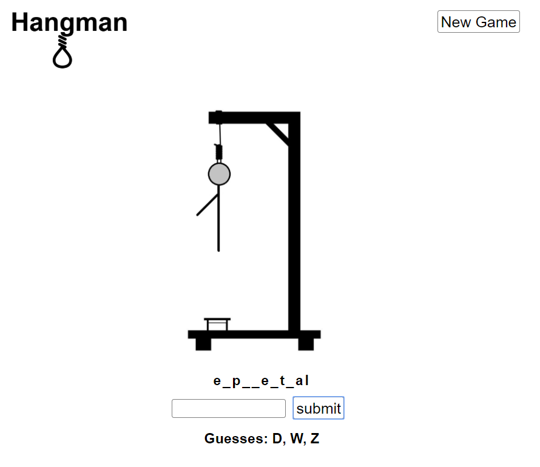

# Hangman

[Hangman]() While experimenting with python I created this modern take on a classic game.  
To try it out yourself clone the frontend https://github.com/LeoVeres/hangman-client 
and 'npm start' then clone this repo and 'python app.py'.

## Screenshots

## Tech Used

### Front-End
* React
* Redux
* HTML
* CSS

### Back-End
* Python
